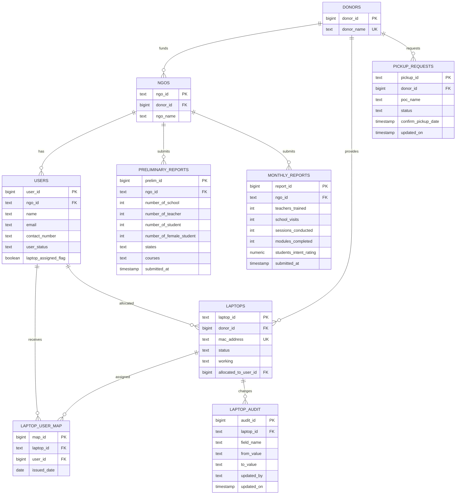

# RDS ERD Draft (from current Google Sheets structure)

This draft is inferred from:
- Apps Script write/read logic in appscript
- Live API payload headers from getLaptopData, getUserData, pickupget, audit, getpre

Use this as the base design for PostgreSQL/MySQL RDS migration.

## 1) Inferred entities

1. donors
- donor_id (PK)
- donor_name (unique)

2. ngos
- ngo_id (PK, from NgoId / registered NGO Id)
- donor_id (FK -> donors.donor_id)
- ngo_name (nullable, if available)

3. users
- user_id (PK, from UserDetails.ID)
- ngo_id (FK -> ngos.ngo_id)
- name
- email
- contact_number
- address
- address_state
- id_proof_type
- id_proof_number
- qualification
- occupation
- date_of_birth
- use_case
- family_members_count
- guardian_occupation
- family_annual_income
- user_status
- laptop_assigned_flag
- assigned_at
- id_link
- income_certificate_link
- created_at
- donor_id (FK -> donors.donor_id, nullable)

4. laptops
- laptop_id (PK, from Laptop Labeling.ID)
- date_committed
- donor_id (FK -> donors.donor_id)
- ram
- rom
- manufacturer_model
- processor
- manufacturing_date
- condition_status
- minor_issues
- major_issues
- other_issues
- inventory_location
- laptop_weight
- mac_address (unique suggested)
- status
- working
- battery_capacity
- allocated_to_user_id (FK -> users.user_id, nullable)
- last_updated_on
- last_updated_by
- assigned_to
- issue_comment
- inspection_files
- activitywatch_pdf
- activity_date
- afk_time
- usage_hours
- off_times
- last_delivery_date
- refurbishment_date
- batch

5. laptop_audit
- audit_id (PK)
- laptop_id (FK -> laptops.laptop_id)
- field_name
- from_value
- to_value
- updated_by
- updated_on

6. pickup_requests
- pickup_id (PK, string like PU<timestamp>)
- donor_id (FK -> donors.donor_id, nullable)
- donor_company_raw
- poc_name
- poc_contact
- poc_email
- number_of_laptops
- pickup_location
- pickup_by
- current_datetime
- status
- confirm_pickup_date
- updated_on
- updated_by

7. laptop_user_map
- map_id (PK)
- laptop_id (FK -> laptops.laptop_id)
- user_id (FK -> users.user_id)
- issued_date

8. preliminary_reports
- prelim_id (PK, from Preliminary.Id)
- ngo_id (FK -> ngos.ngo_id)
- number_of_school
- number_of_teacher
- number_of_student
- number_of_female_student
- states
- unit
- courses
- donor_id (FK -> donors.donor_id, nullable)
- submitted_at

9. monthly_reports
- report_id (PK)
- ngo_id (FK -> ngos.ngo_id)
- teachers_trained
- school_visits
- sessions_conducted
- modules_completed
- students_intent_rating
- submitted_at

10. metrics_base
- metric_id (PK)
- metric_key
- metric_value
- source_date

11. average_days_count (derived)
- id (from laptop_id)
- pickup_requested_date
- distributed_date
- days_difference
- calculated_on

Note: average_days_count is derived from audit and should ideally be a view/materialized view in RDS.

## 2) ERD (Mermaid)

## 3) Important normalization notes

- Donor appears as free text in multiple sheets (Donor Company Name, Donor Company, Doner). Normalize to donors table.
- NgoId links users, preliminary, and monthly data. Treat as foreign key to ngos.
- Laptop allocation exists both as laptop field (Allocated To) and mapping table (LaptopUserMap). Keep mapping table as source of assignment history.
- Audit is append-only event data and should stay separate from laptops.
- File links are URLs (Drive); store as text in RDS, files remain in Drive/S3.

## 3.1) Frontend Dependency Findings (important for RDS migration)

From current frontend usage in `src`, these APIs and field names are tightly coupled and should be preserved via API compatibility layer during migration.

1. Most-used read endpoints
- `type=getLaptopData` is used across OPS pages, donor CSR dashboards, table views, and filters.
- `type=getUserData` is used in beneficiary listing/profile/edit flows.
- `type=getpre` is used in preliminary/monthly/yearly scheduling flows.
- `type=pickupget` is used in pickup request dashboards and donor overview widgets.
- `type=audit` is used in OPS audit table.

2. Write endpoints used by frontend
- `type=laptopLabeling`
- `type=userdetails`
- `type=userdetailsbulkupload`
- `type=editUser`
- `type=deleteUser`
- `type=preliminary`
- `type=Pickup`
- `type=updatepickupstatus`
- `type=UpdateLaptopComment`

3. Critical field-name compatibility (case and spacing matter)
- Laptop records: `ID`, `Donor Company Name`, `Mac address`, `Status`, `Working`, `Allocated To`, `Assigned To`, `Comment for the Issues`, `Inspection Files`, `Battery Capacity`, `Last Updated On`, `Date Committed`, `Last Delivery Date`, `Batch`.
- User records: `ID`, `Ngo`, `name`, `email`, `contact number`, `ID Proof type`, `Use case`, `Occupation`, `status`, `Laptop Assigned`.
- Preliminary records: `Id`, `NgoId`, `Number of student`, `Unit`, `Doner`, `States`, `Course/Courses`.
- Pickup records: `Pickup ID`, `Donor Company`, `POC Name`, `POC Contact`, `POC Email`, `Number of Laptops`, `Pickup Location`, `Pickup By`, `Current Date & Time`, `Status`, `Confirm Pickup Date`, `Updated On`, `Updated By`.
- Audit records: `ID`, `Field`, `From`, `To`, `Updated By`, `Updated On`.

4. Frontend behavior assumptions to preserve
- Several pages fetch full `getLaptopData` and apply client-side filters; backend sort/order and stable field availability are important.
- `PickupRequestByDoner` defaults missing pickup `Status` to `Pending` in UI; DB/API should support null-safe defaulting.
- Beneficiary status workflows send `assignedAt` when status becomes `Laptop Assigned`; keep `users.assigned_at` and backward-compatible write mapping.
- Preliminary/monthly screens rely on `Unit` as a date anchor for generating monthly/yearly schedules.

5. Notable integration risk found
- `src/Pages/Pickup/Pickup.js` posts to a hardcoded Apps Script URL instead of `REACT_APP_LaptopAndBeneficiaryDetailsApi`; this must be switched during final RDS cutover to avoid split writes.

## 4) What is still uncertain

- Exact data types for several fields currently stored as mixed text in sheets.
- Whether users.user_id is globally numeric everywhere (some code compares as string).
- Whether preliminary_reports.prelim_id should stay random 3-4 digits or move to sequence/UUID.
- Whether monthly report ID should be independent sequence or business ID.
- External dependency on Registered NGO sheet columns and quality.
- In code, laptop-user mapping tab is referenced as both `LaptopUserMap` and `Laptop-User-Map`; this needs one canonical source table during migration.
- `DataPdf` in `pdfdownload.js` reads `Laptop Labeling` from a different spreadsheet ID than the main backend; decide whether that is legacy or active production data.

## 4.1) Extra findings from full appscript pass

- `UserDetails` appears to include assignment timestamp behavior (`Assigned At`) in status update flow.
- `Preliminary` writer stores course values from `courses`, while reader parses `Course`/`Courses`; migration should normalize this into one canonical `courses` representation.
- `Inspection Files` is appended with multiple URLs (comma-separated) in PDF upload flow; model this as either a separate file table or a JSON/array column.

## 4.2) External spreadsheet dependencies found in code

1. Registered NGO reference
- Spreadsheet ID: `1kzVjIU7ChPWV01gY3b7-4fsk9pO-_WXnWdg7VMjg4k4`
- Sheet: `Registerd NGO`
- Used by: `Preliminary.js`
- Purpose: map `Id` -> `Doner`

2. Secondary Laptop Labeling reference
- Spreadsheet ID: `16t_EqujkDWTDtVNKZvyHGuUsFt1tGqnTvmMCgz49d2Q`
- Sheet: `Laptop Labeling`
- Used by: `pdfdownload.js`
- Purpose: append generated PDF URL into `Inspection Files`
- Action needed: confirm if this is legacy/testing or should be part of final migration scope

## 5) What is required from your side

Please share these to finalize the production schema:

1. Full header row for each sub-sheet (exact spelling and order)
- Laptop Labeling
- UserDetails
- Pickup
- Audit for Laptops
- Preliminary
- Report
- LaptopUserMap
- Metrics Base
- Registered NGO (external workbook)

2. Primary key decisions
- Confirm final PK for each table (natural key vs surrogate ID)
- Confirm whether existing IDs must be preserved exactly

3. Relationship rules
- Confirm UserDetails.Ngo always maps to Registered NGO.Id
- Confirm how donor should map when only free text exists

4. Data type and enum rules
- Allowed values for Status, Working, Condition Status
- Date formats and timezone to standardize
- Numeric constraints (battery_capacity, usage_hours, counts)

5. Nullability and defaults
- Which fields are mandatory at insert
- Default values for status and timestamps

6. History policy
- Should laptop assignment history be full audit trail
- Soft delete vs hard delete requirements

7. Scale and performance expectations
- Current row counts per sheet
- Daily inserts/updates
- Required response-time targets

8. Security and compliance
- Which columns contain PII and need masking/encryption
- Role-based access requirements (admin, NGO, donor, ops)

9. Migration constraints
- One-time backfill window
- Cutover strategy (big-bang vs dual-write)
- Rollback expectation

10. RDS choices
- Engine: PostgreSQL or MySQL
- Region/VPC details
- Backup/retention expectations

## 6) Immediate next step

Once you share item (1) and (2), we can produce:
- Final ERD with exact column-level FKs
- Production-grade CREATE TABLE SQL
- Data migration scripts (sheet CSV -> staging -> final tables)
- Index plan based on your dashboard/query patterns
