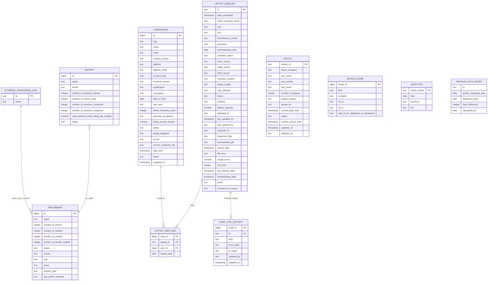
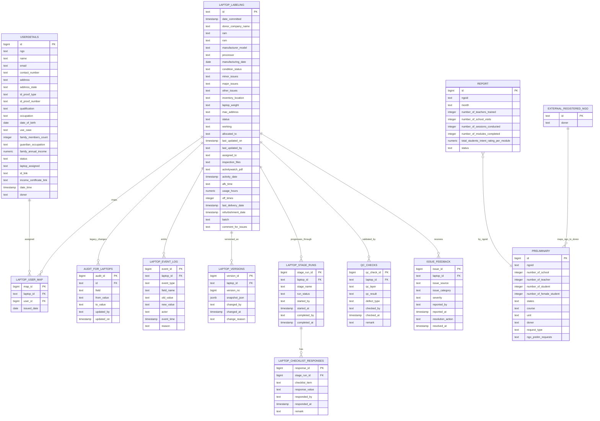

# Original ERD

# How to Include Changes (without normalization)

1. Keep `LAPTOP_LABELING` as the latest-state table for all existing reads.
2. Add `LAPTOP_EVENT_LOG` as append-only history for every update event.
3. Add `LAPTOP_VERSIONS` as full snapshot per version (one row per laptop change).
4. Add `LAPTOP_STAGE_RUNS` to track process stage execution attempts.
5. Add `LAPTOP_CHECKLIST_RESPONSES` for checklist/gate compliance.
6. Add `QC_CHECKS` to support layered QC.
7. Add `ISSUE_FEEDBACK` for post-dispatch learning and repeated-failure tracking.
8. Write flow for each update:
	 - read current laptop row
	 - update `LAPTOP_LABELING`
	 - insert field-level event into `LAPTOP_EVENT_LOG`
	 - insert row snapshot into `LAPTOP_VERSIONS`
	 - insert/update stage and QC tables if status changed

# New ERD (with Control, Traceability, Learning)

